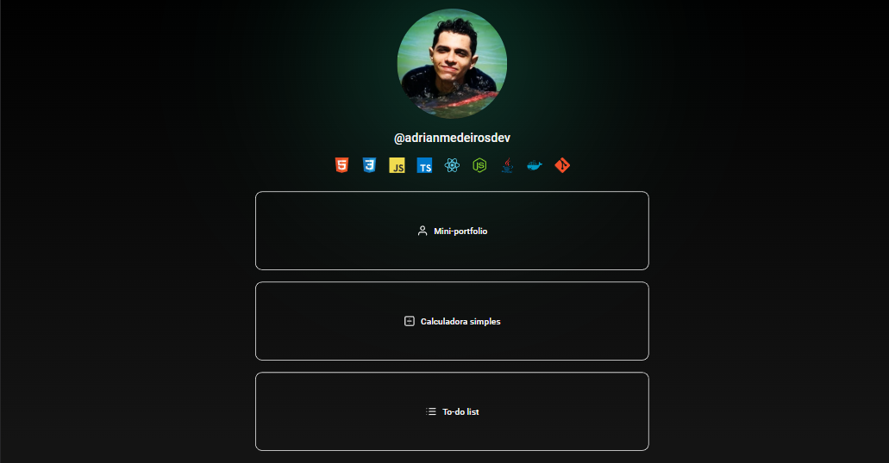

# 💻 Mini-portfolio

  

### 🚀 Technologies

This project was developed using these technologies:

- HTML, CSS and JS
- Git and Github

You can take a look by <a href="https://adrianmedeirosdev.github.io/mini-portfolio" target="_blank">clicking here</a>.
### ⚖ License

